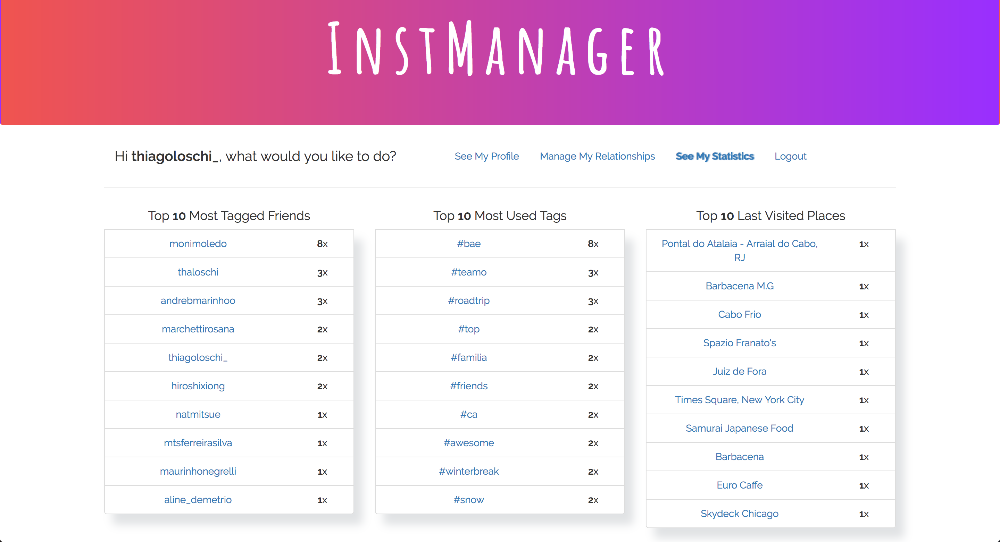

# InstManager

1. [Description](#description)
2. [Technologies](#technologies)
3. [Status](#status)
4. [Website](#website)
5. [Screencast](#screencast)
6. [Screenshots](#screenshots)

### Description
InstManager is an Instagram client created with the unique purpose of entertaining Instagram users by providing cool insights and usage statistics from their Instagram accounts. Users will be able to see which of their friends follow them back and will have the ability to follow and unfollow other users.
  

### Technologies
This application uses Nodejs, Expressjs, MongoDB and Angularjs among other technologies.
 

### Status
InstManager is running in SandBox mode, which means I must give you a valid key in order for you to try it. The reason why it is not running in its full version, is that Instagram denied the use of their API in production mode, for the uses cases I presented. :(

You are still able to try it, though. Just send me a message and I'll whitelist your credentials.
  

### Website
Although the application is already live at https://instmanager.herokuapp.com, only SandBox users can try InstManager. Send me an email to: thiagoloschi@gmail.com if you'd like to give it a try.
  

### Screencast
A screencast was recorded and posted on my youtube channel at https://www.youtube.com/watch?v=oxg1W7nKnqg
  

### Screenshots
  

<h6 align="center">Main Profile</h6>
   

<h6 align="center">Statistics Page</h6>
   

<h6 align="center">Relationships Page</h6>
   

